# Project 3: Face Morphing! :) 

Follow along with the code [here](https://github.com/CamilleDang/proj3)!

#  Overview

During this project, I morphed faces together by selecting correspondence points of important facial features, computing the Delauney triangulation of the points, and corresponding affine transformations, in order to successfuly warp the face structure and used cross-dissolving to interpolate corresponding colors! This allowed me to morph between images (ex: images of my mother and me, and me at different ages!) as well as calculate the 'average face' of two images or of a population and exaggerate key features of an individual.

#  Part 1. Defining Correspondences

I chose to morph between my mother and me! 
In order to do this, I first selected two images of us in similar positions and cropped them to be the same size. I then selected 60 correspondence points at key feature points (facial features such as eyes, nose, mouth, rim of face, rim of hair + 4 points at each corner of the image), using matplotlib and ginput, and stored each mouse click in an array of points, with a button press indicating the end.
I then computed the Delauney triangulation of the corresponding points (using `scipy.spatial.Delaunay`), which enabled triangle-to-triangle correspondences for both images.

| Mother Triangulation | Me Triangulation | 
|:-------------------------:|:-------------------------:|
|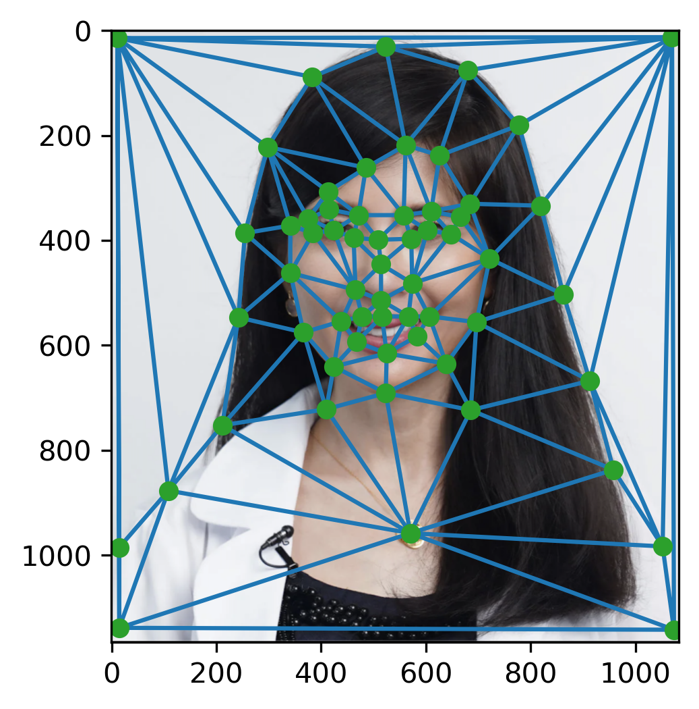 |  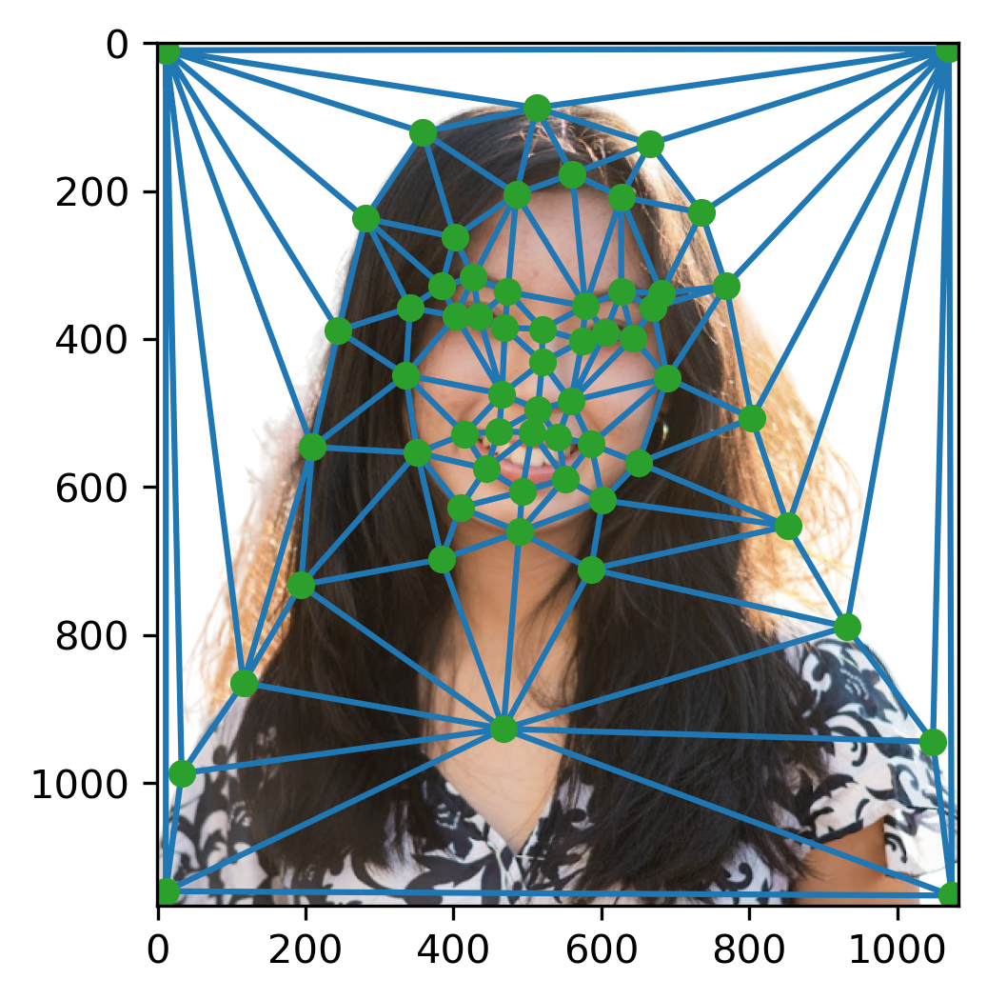 |

#  Part 2. Computing the 'Midway' Face

The goal was now to compute the 'midway' face between my mother and me. In order to do this, I completed the following steps:
1. Compute the average points by adding mine and my mother's correspondence points and then dividing in half.
2. Compute the Delauney triangulation of the average correspondence points.
The goal was then for each image, warp each image to the average shape, also sending the correct color pixel from the original image to the corresponding location in the new average shape.
3. Create a function to calculate the affine transformation matrix between a set of 3 original/'source' (x, y) points and 3 destination (x, y) points.
Complete for both images:
4. For each triangle in the midway triangles:
   
   a. Find corresponding vertex coordinates for triangle in midway image.
  
   b. Find corresponding vertex coordinates for triangle in original image.
  
   c. Compute the affine transformation matrix between the vertex coordinates of original triangle and the vertex coordinates of midway triangle.
  
   d. Compute the inverse of the affine transformation matrix, which will be used for inverse warping: using the vertex points from the midway triangle to find the corresponding vertex  points from the original triangle.
  
   e. Grab all the points within the midway triangle, using `skimage.draw.polygon`.
  
   f. Find the original points by multiplying the points found in part e with the inverse matrix found in part d (to ensure dimensions were right, I padded the points found in part e   with a column of ones)
  
   g. Using scipy.interpolate.griddata and the 'nearest' method, interpolate the color from the original triangle to the corresponding location in the midway triangle.
  
5. This should yield both images warped to the average shape!

| Mother Warped to Average | Me Warped to Average | 
|:-------------------------:|:-------------------------:|
|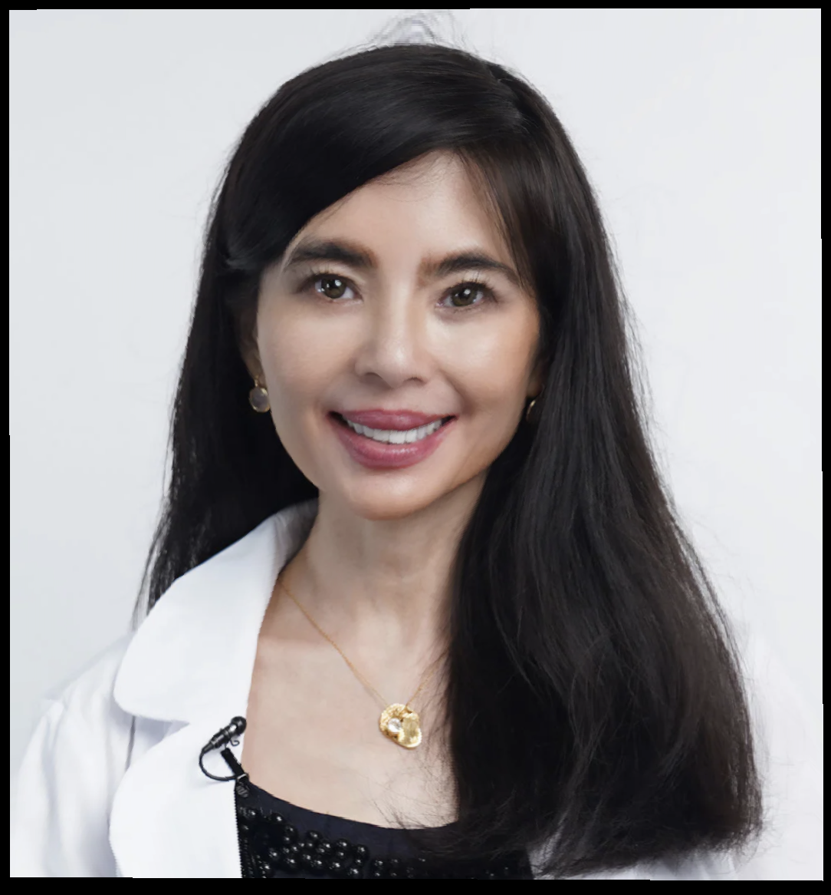 |  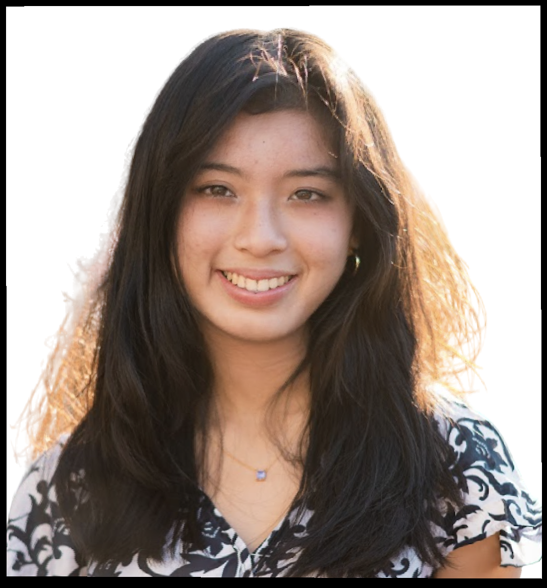 |

6. Average the two images to create the 'midway' face by cross-dissolving the two images like such: `(1 - frac) * im1 + frac * im2`, with frac being 0.5

| Mother Original | Me Original | Mother & Me 'Midway' |
|:-------------------------:|:-------------------------:|:-------------------------:|
|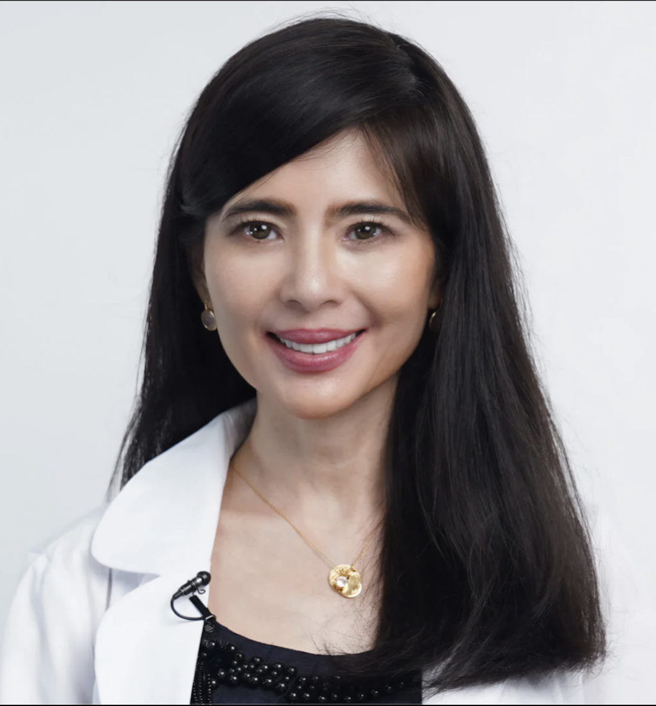  |  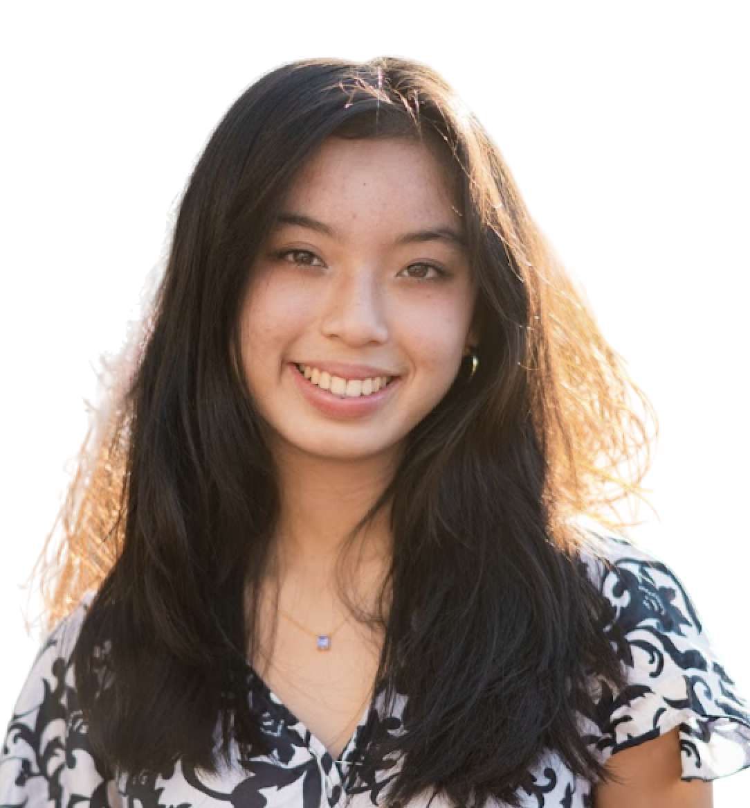 | 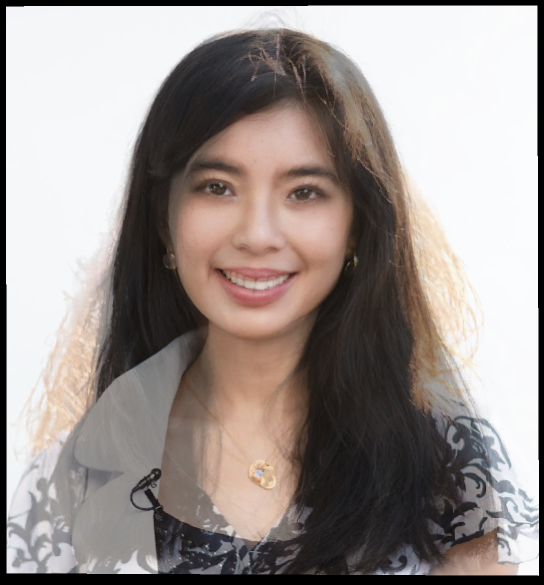 |

The results turned out really well! I covered most of this logic (except for cross-dissolving) in the function `warp_from_avg(im1, im1_pts, avg_pts)` to reuse for warping one image to an average of that and another image.

# Part 3. The Morph Sequence

Using the logic from above, I created the function morph, which morphs two images based on 6 inputs: the two images and their corresponding points as well as the warp_frac and dissolve_frac, which respectively represents the weight of the shape configuration and the weight of the cross-dissolving.

      def morph(im1, im2, im1_pts, im2_pts, warp_frac, dissolve_frac):
          avg_shape = (1 - warp_frac) * im1_pts + (warp_frac * im2_pts)
          endres1 = warp_from_avg(im1, im1_pts, avg_shape)
          endres2 = warp_from_avg(im2, im2_pts, avg_shape)
          res = cross_dissolve(endres1, endres2, dissolve_frac)
          return res

Using this function, I created a gif that shows the incremental morphs from my mom's face to mine! I made the gif with 50 frames at 50 milliseconds each.

 

# Part 4. The "Mean Face" of a Population

### Choosing Dataset & Processing Correspondence Points

With the ability to now warp faces to find the average of two faces, I used this logic to compute the "mean face" of a population of people. I used the [FEI dataset](https://fei.edu.br/~cet/facedatabase.html), which came with correspondence points for each of 400 images (2 for each subject - one smiling and one neutral). 
I first processed the datapoints, extracting the points from the corresponding files and storing them in npy files. I also added the 4 corners to each of the points to get a better morphing result. I chose to work with the 200 **smiling** images.

### Computing the Average Points of the Population

I then computed the average points of the population, using np.mean on all the correspondence points.

### Morph each of the faces in the dataset into the average shape.

Using the previous `warp_from_avg(im1, im1_pts, avg_pts)` function, I morphed each of the 200 images to the average shape, passing in the image, its correspondence points, and the average points calculated in the previous part. Here are some examples!

The **top** images are the **original images**, and the **bottom** images are the **corresponding image morphed to the average**.

| Individual 9 | Individual 51 | Individual 123 | Individual 187 | 
|:-------------------------:|:-------------------------:|:-------------------------:|:-------------------------:|
|  |   | 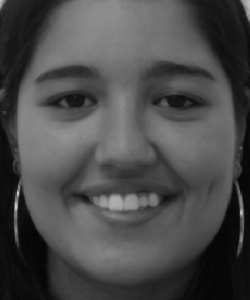 | 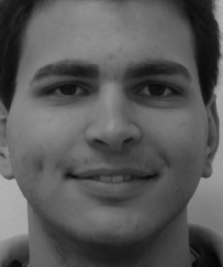 |
|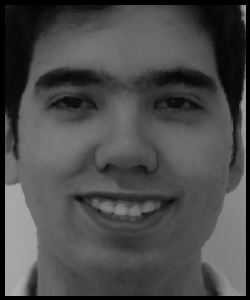  |  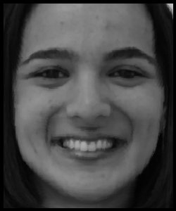 | 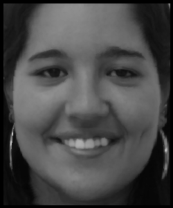 | 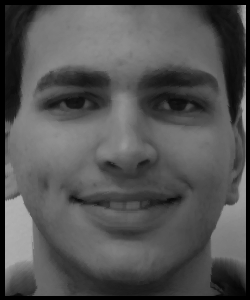 |

#### Computing the average face

I then averaged all the images to find the average face of the 200 smiling individuals!

 

How gorgeous!

#### Computing my face to the average geometry & the average face to my geometry

In order to compute my face to the average geometry, I had to recrop my image to the size of the FEI images and also replot correspondence points according to how the FEI dataset plotted theirs. I first annotated the average image and the points with the number of ordering, and then used a similar plotting on my own image. 

| Average with Ordered Correspondence Points| Me with New Correspondence Points | 
|:-------------------------:|:-------------------------:|
|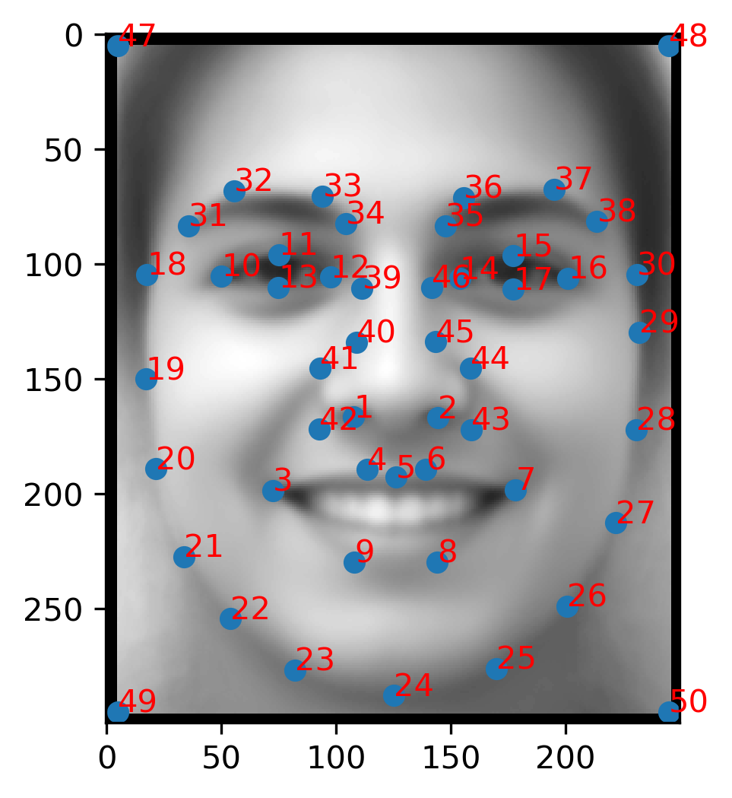 |  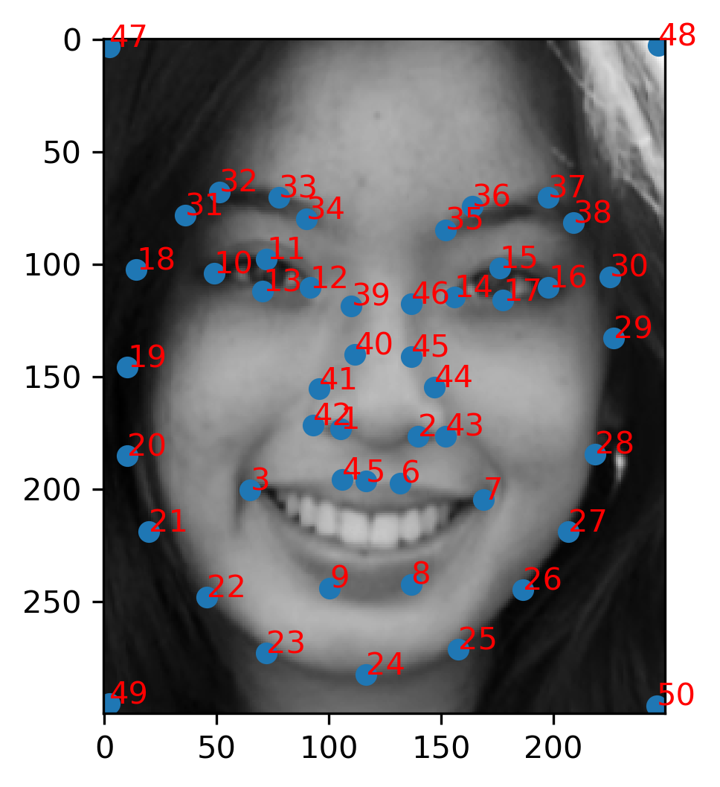 |

To compute my face to the average geometry, I simply used my previous `warp_from_avg` function, taking in my face, the new correspondence points, and the average correspondence points. I did the same for the other way around, using `warp_from_avg` but with the average face, average correspondence points, and my correspondence points to compute the average face to my geometry.

| My Face to Average Geometry | Average Face to My Geometry | 
|:-------------------------:|:-------------------------:|
|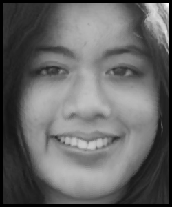 |  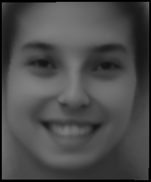 |

# Part 5. Caricatures: Extrapolating from the Mean

I created caricatures of my face by using my previous morph function, and adjusting the warp_frac, where a warp_frac of below 0 exaggerates my features and a warp_frac of above 1 exaggerates the mean population's features on my face. Below is a progression of caricatures with the corresponding warp_fracs of -1, -0.5, 0.5, 1.5, and 2, going from exaggerating my features to exaggerating the mean population's features. The middle represents the exact average between my face the average mean population.

| Warp_Frac = -1 | Warp_Frac = -0.5 | Warp_Frac = 0.5 | Warp_Frac = 1.5 | Warp_Frac = 2 |
|:-------------------------:|:-------------------------:|:-------------------------:|:-------------------------:|:-------------------------:|
|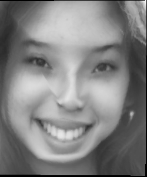 |  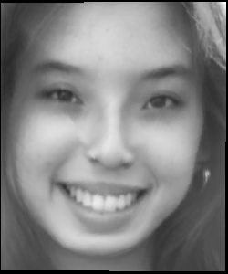 | 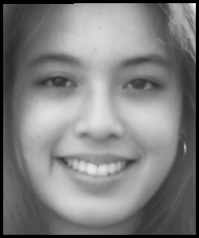 | 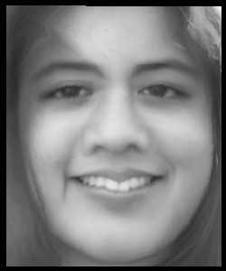 | 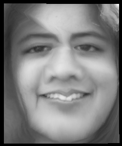 |

# Part 6. Bells and Whistles

For the last part of the project, I chose to create a morphing video of me growing up! I selected 12 images, ranging from my birth year to the present year! Each image corresponds respectively to the years 2005, 2009, 2013, 2016, 2017, 2018, 2019, 2020, 2021, 2022, 2023, and 2024.

I cropped all the images to the same size and slightly rotated a couple of them for easier morphing. Here are the 12 cropped images:
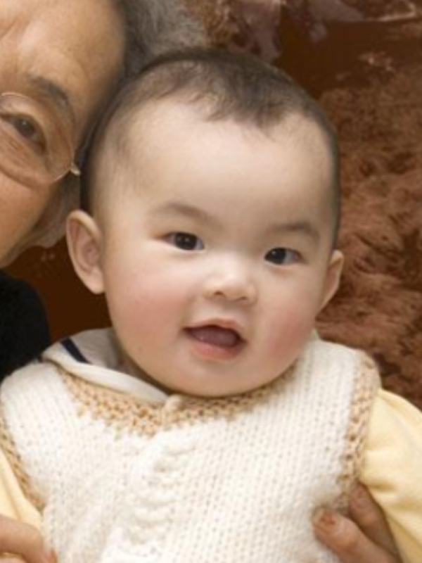  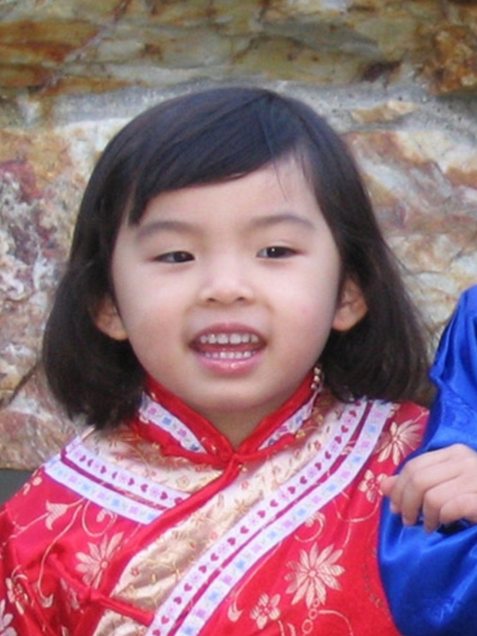  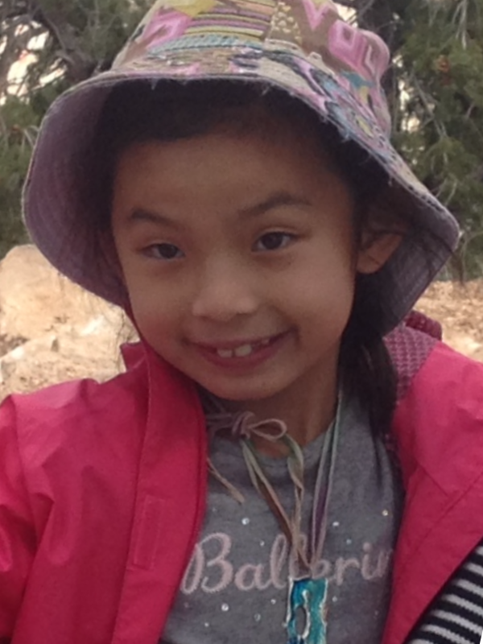  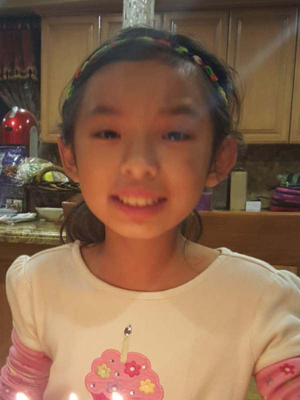 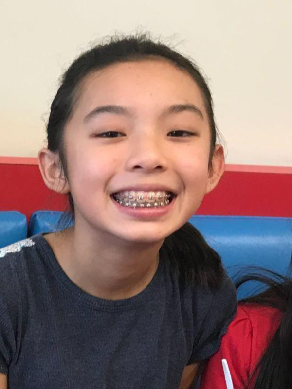  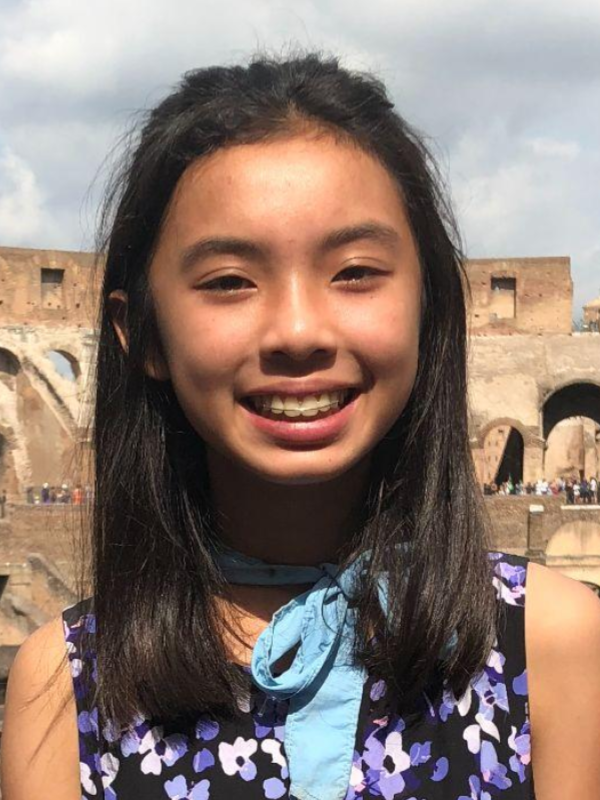
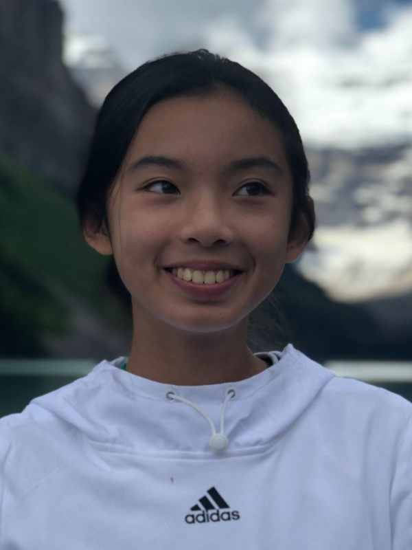  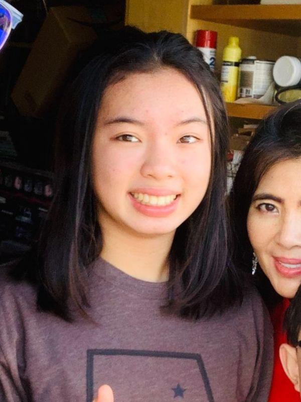  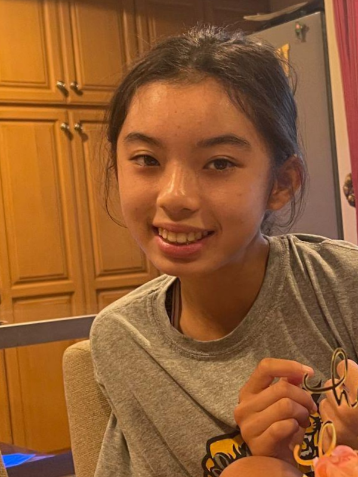  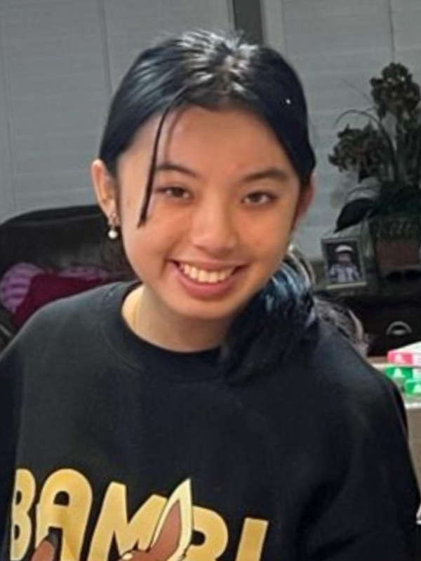  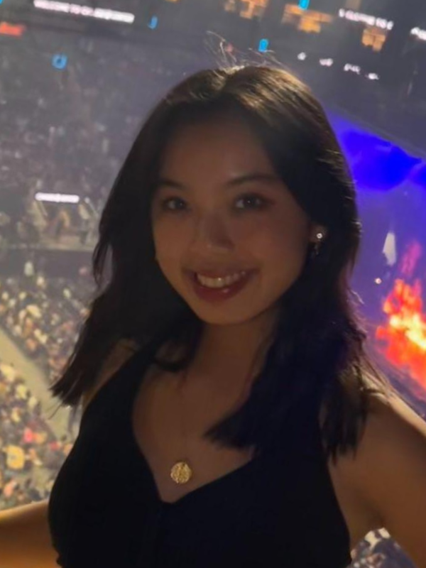  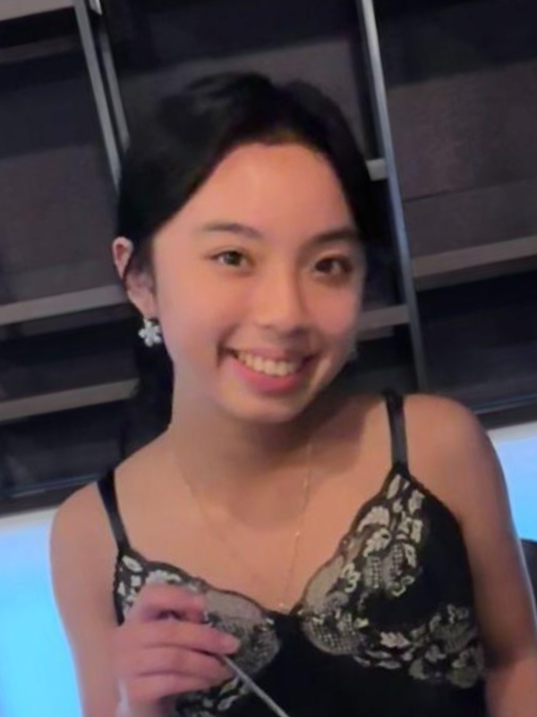 

Here is a music video to one of my favorite instrumentals ever - "Growing Up" by Nate Blaze. How fitting!

*Click on baby me to go to the Youtube video!*

[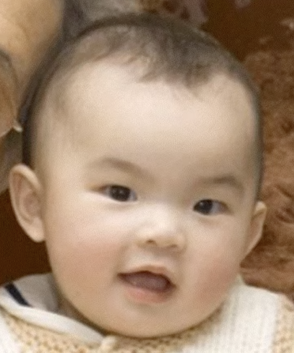](https://www.youtube.com/shorts/qNRFlizloks "Me Growing Up!")

